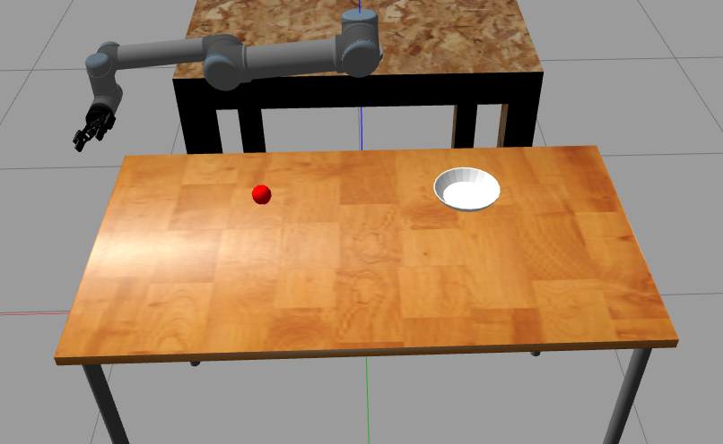
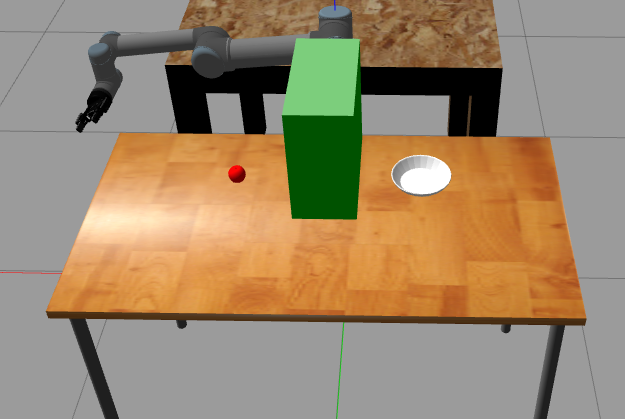

# ROS/Gazebo Robotic Arm Simulation

This package contains the simulation of the Universal Robots [UR5](https://www.universal-robots.com/products/ur5-robot/)  Robotic Arm with attached Robotiq [2F-85](https://robotiq.com/products/2f85-140-adaptive-robot-gripper) gripper as an end effector.

This type of robot is readly available and contains a ROS package which has the robot's urdf which can be found [here](https://github.com/ros-industrial/universal_robot/tree/noetic-devel) and its end effector is also available and there is a ros package which contains the gripper as a urdf file.

A universal robot UR5 with attached end effector attached at its end of type Robotiq 2F-85

## Getting Started

Extract the workspace in your home folder 

### Prerequisites

The following packages was tested using the following:

Ubuntu 20.04  
ROS Noetic  
Gazebo 11.11 

Make sure you have the following packages and dependencies installed or install them using these commands:

```bash
sudo apt-get install ros-noetic-joint-state-controller ros-noetic-position-controllers ros-noetic-joint-trajectory-controller

sudo apt-get install libfcl-dev

sudo apt-get install ros-noetic-moveit ros-noetic-moveit-plugins ros-noetic-moveit-planners

sudo apt-get install ros-noetic-universal-robots
```
NB: other dependencies may be required to be installed according to your ros packages installed.
### Compiling and Folder Structure

This workspace contains the simulation_ws which contains all packages required for simulation, as well as videos of the simulation.

    .
    ├── Videos                   # Videos of the simulation
    ├── simulation_ws            # the workspace which contains the simulation environment and nodes
    └── README.md                # Documentaion of the subbmision

compile the simulation_ws using catkin_make.

```
cd ~/simulation_ws/
catkin_make
```

and then source them. 

```
cd ..
source devel/setup.bash
```

## Environment Setup

A very simple kitchen environment world is used in this simulation which consists of a table where the robot rest on, a table where we perform the simulation; an apple and a plate. 


After sourcing your environment to run the simulation with no obstacles use the command:
```bash
roslaunch ur5_gripper_moveit_config demo_gazebo.launch
```
After running this command you should see the following simulation environment on the gazebo.

 

To run the node for picking and placing the apple in the plate run the node pick_and_place using the command:
```bash
rosrun ur5_simple_pick_and_place pick_and_place
```
you should see the robotic arm moves towards the apple grasps onto in and place it onto the table.


Another simulation environment where there is an obstacle in between.
```bash
roslaunch ur5_gripper_moveit_config demo_gazebo_obstacle.launch 

```

 

Run the node pick_and_place using the command:
```bash
rosrun ur5_simple_pick_and_place pick_and_place_collision
```

### Simulation parameters and tuning 

Apple model file was obtained from free cad websites it was [downloaded](https://free3d.com/3d-model/apple-26596.html) as a .dae file.
Simulation parameters was set for the apple to mimic real life apple including its weight which was about 100 g also slipping, stiffness and coofficient of friction was taken into consideration and its parameter are set, it can be found in world directory inside ur5_simple_pick_and_place package with model name "apple". 

Universal Robots (UR5) PID parameter was obtained and tuned for better accuracy of the robotic arm trajectory. The tuned PID parameters makes the robot navigate accurately to the apple position picking it up and placing it onto the plate. 


### Path planning enhancement

Path planning technique used was based on OMPL library for planning techniques it might struggle to give the robot the right trajectory from the first time and it might hit the collision obstacle differnt path planning techniques was used during simulation and further enhancement needed for a trajectory which is far away from the obstacle it still does not take a path which passes through the obstacle but it might hit due to tollerance and might need some parameters tuning 
